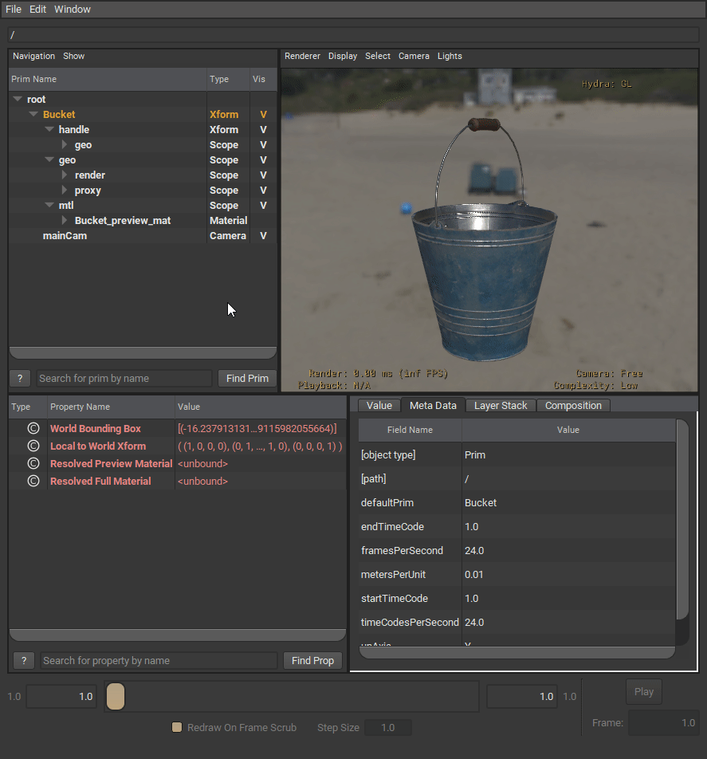
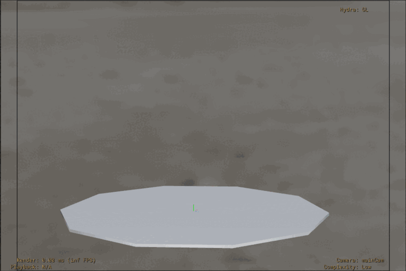

TODO & Questions:
- todo: pipe to extract transcribes from meetings.
  - use local LLM
  - make batch script that runs over all recordings.
  - workflow? -- Find recordings, transcribe, save as <record_name>.txt/vtt
- todo: [next] re-listen call & take notes.
  - Meeting Takeaways:
    - Some assets might want to have more subcomponents to enable two-way posing.
      Bucket receptacle and handle will rotate from the same pivot position.
    - for scalability: geo, mtl scopes should be instanceable. purposes nice for VP
    - note: set dressing artists can do sims
    - Target of the PR --Components w/Subcomponents in the case of instancing and dressing. -- what is needed to consider when doing that.
    - Showing people my example of variants where some are defined in the asset and some in the shot is valuable.
      even if it's not the most efficient way to do it. "This is a way to do it it comes with its own tradeoffs"
    - "it makes sense for this workflow to have the assets structured this way"
    - risk, if it gets too complicated. carefully to not make it hard to get your head around it. who is the audience, how much capacity they have.
    - "if you want to save a pivot, you should make it a prim. and mark as subcomponent"
    - openExec will be able to create constraints to solve corkscrew and door+bucket.
    - note: skip usdSkel and rigSwapping for this release.
    - subcomponents out of /geo
    - recommended to have a subcomponent prim parent over the child mesh prim, DONT use nested gprims.
    - note: group kind is supposed to be Model hierarchy and subcomponents are not Models. dont use it.
- todo: ...
- todo: mention bad practices. And make sure the example assets dont have them.
- todo: Cleanup Example asset composition. --simplify and describe what its happening, different levels of complexity.
- todo: add comparison between proxy and render. VP + Outliner


- Assemblies and subcomponent's composition/structure looks very similar.\
  Any notable differences? Assemblies are not self-contained. Instancing?
  pd: looking at assemblies it works that way, so it might not be that wierd after all.
- Should subcomponent prim replicate component structure geo, mtl scopes.\
  It looks counterintuitive to have meshes outside /geo?\
- Can we come up with a go-to/recommended structure for subcomponents?.\


- Is there a way to make the subcomponents instanceable so only a xform is authored? Will hydra reuse prototypes in that case?\
This will be very similar in Assembly Models.\
Stage with Box(C) + FruitBox(A) + BreadBox(A) where FruitBox=(Box + Fruit) and BreadBox=(Box + Bread); 
I would expect Box to not be triplicated in memory. Is this a case where Hydra will de-duplicate the box? Is that right? How could I tell?


- Future considerations with Assemblies that are made out of Components attached to subcomponents.\
  ex: some tools attached to the WoodenTable.door subcomponent.\
  Examples continuing in this direction will soon need a rig. Can be handled with rig-swapping.


# How to take advantage of subcomponents in production


## What are Subcomponents?
In USD terms, [subcomponents](https://openusd.org/release/glossary.html#usdglossary-subcomponent)
are a [kind](https://openusd.org/release/glossary.html#usdglossary-kind) that can be assigned to a prim.

> **Callout:**
> Before continuing to read, please have a look at the **Asset Structure Guidelines** if you are not familiar with them,
as it explains some concepts I'm going to be talking about.
> https://github.com/usd-wg/assets/blob/main/docs/asset-structure-guidelines.md


## Composition

In this section there will be some examples ordered from simple to complete. Where the complete has the most features and is a better structure for scale.


Main considerations:
- Where is the kind applied? Directly to the mesh prim or to a parent xform. --Recommended parent xform
  - If using render purposes it has to be into a parent xform prim, so we can have the render, proxy scopes under it.
- Using render purpose?
  - If so, the subcomponent kind has to be applied into a parent xform prim, so we can have the render, proxy scopes under it.\
    This way both representations get the same transformations.
- Should Subcomponent prims be under asset/ or under asset/geo ? --Recommended under asset/ so we can use instancing.
  - If we [mirror the overall structure of a Component for each Subcomponent](https://github.com/Lucas3Dspain/assets/blob/guidelines-subcomponent/docs/asset-structure-guidelines.md#:~:text=each%20subcomponent%20can%20mirror%20the%20overall%20structure%20of%20a%20simple%20component.); 
It wouldn't make sense to put it under geo as it can also contain materials. This is similar to the Assembly structure, where Components are outside the geo scope.
 
- we can do a from best to worst structure. Or a from simple to complete, where complete has the most features + scalable.

**Simple Subcomponent** (Variations to consider):

In this example I want to show an asset that doesn't use render purposes and has an articulated piece, the handle. Explain issues with instancing.
```
/Bucket                 (xform) ← Component Kind
    /geo                (scope)
        /bucket         (mesh)
        /handle         (xform) ← Subcomponent Kind★
            /wire       (mesh)
            /handle     (mesh)
    /mtl                (scope)
/__class__              (class)
    /Bucket             (class) ← Inherited by /<component>
```

In this variation, the handle is made out of many prims (wire, handle) and we want all of them to move together.\
We group them under a xform prim that will be located in the pivot position. this way we can have /geo as instanceable.
```
/Bucket                 (xform) ← Component Kind
    /geo                (scope) ← Instanceable★
        /bucket         (mesh)
    /mtl                (scope)
    /handle             (xform) ← Subcomponent Kind
        /geo            (scope) ← Instanceable★
            /wire       (mesh)
            /handle     (mesh)
/__class__              (class)
    /Bucket             (class) ← Inherited by /<component>
```

**Simple Subcomponent - With Purpose Scopes** (Recommended)

todo: explain render scopes like in Asset Guidelines. Twist on benefits for articulation.

```
/Bucket                 (xform) ← Component Kind
    /geo                (scope) ← Instanceable
        /proxy          (scope) ← Purpose: proxy★
        /render         (scope) ← Purpose: render★
    /mtl                (scope)
    /handle             (xform) ← Subcomponent Kind
        /geo            (scope) ← Instanceable
            /proxy      (scope) ← Purpose: proxy★
            /render     (scope) ← Purpose: render★
/__class__              (class)
    /Bucket             (class) ← Inherited by /<component>
```

**Shallow Subcomponent** (WoodenTable example)

todo: Keep Subcomponents outside /geo and don't use Group Kind.

```
/WoodenTable        (xform) ← Component Kind
    /geo            (scope) ← Instanceable
        /proxy      (scope) ← Purpose: proxy
        /render     (scope) ← Purpose: render
    /mtl            (scope)
    /door           (xform) ← Subcomponent Kind★
        /geo        (scope) ← Instanceable
    /drawers        (xform) ← Make sure this is not Group Kind★
        /drawer1    (xform) ← Subcomponent Kind★
            /geo    (scope)
        /drawer2    (xform) ← Subcomponent Kind★
        /drawer3    (xform) ← Subcomponent Kind★
        /drawer4    (xform) ← Subcomponent Kind★
/__class__          (class)
    /WoodenTable    (class) ← Inherited by /<component>
```

**Nested Subcomponent** (Antenna example)


```
/Antenna                (xform) ← Component Kind
    /geo                (scope) ← Instanceable
    /mtl                (scope)
    /base               (xform) ← Subcomponent Kind★
        /geo            (scope) ← Instanceable
        /upperArm       (xform) ← Subcomponent Kind★
            /geo        (scope) ← Instanceable
            /lowerArm   (xform) ← Subcomponent Kind★
                /geo    (scope) ← Instanceable
                /...
/__class__          (class)
    /Antenna        (class) ← Inherited by /<component>
```

## Uses for Subcomponents

- Proxy mesh generation
- Articulations
- Auto rigging
- Rig-swapping

### Proxy mesh generation

To generate the proxy purpose geometry, we can make it manually if needed or, more commonly,
using an automated process that merges the meshes into one prim and optimizes the topology. This is something very common, what we did was use the
kind:subcomponent to filter prims so that we don't merge them, that way we can still have articulation represented in the proxy purpose.

The geometry under the proxy scopes should have:
- as few prims as possible without loosing articulated pieces.
- as few polygons while maintain volume and silhouette.

- todo: add comparison between proxy and render. VP + Outliner

### Articulations

\

Articulations are movable elements within the asset.
It typically involves child primitives with strategically placed pivots and is identified by a kind:subcomponent designation.
These articulations serve as the adjustable elements that contribute to the asset's flexibility and adaptability.

Articulations are ***rigid*** when only xform transformations are required.

Articulations can be used to reduce asset repetition and to adapt to their surroundings, creating a more cohesive look in the scene.

For instance, consider an Oven asset; rotating the door (articulated piece) achieves the open/closed pose.

This is an example of dressing a scene with a Component assets with subcomponents:
[Dressing_workflow.mp4](screenshots/Dressing_workflow.mp4)

note: this workflow allows maximum flexibility at the cost of instancing. see more in the Optimization & instancing section.


#### Optimization & instancing
Articulated assets come with a limitation – they cannot be both posed and instanced simultaneously.\
This is due to the fact that when a parent prim is made instanceable, the child prims won't receive any edits.

todo: rephrase this to explain exactly what the limitation is regarding instancing. SIGGRAPH 23 meeting.

To address this limitation, a workaround can be employed, particularly when a few distinct poses are enough.

One effective workaround involves creating a "pose" VariantSet within the Model's defaultPrim,
acting as a repository for a library of poses. Variants are added to this VariantSet,
offering a flexible solution for managing different poses that can be instanced.


These are the variants defined in the pose VariantSet at the asset level.
See more in the [example file](assets/Bucket/example_dressing.usda) to see how to use asset-level pose variants in dressing.



This is an example of how to use asset-level variants in dressing. 
[example_dressing.usda](assets/Bucket/example_dressing.usda)

Additionally, extra poses can be added from a Dressing/Shot definition. See more in the [example file](assets/Bucket/example_dressing_variants.usda).\
Use case where we need to dress the Bucket upsidedown and use it many times, lets assume that's a rare enough case that it shouldnt be defined in the asset.\
In this dressing scene we can use the upside_down variant to make use of instances.



Example file of a dressing where the upside_down variant is added just for that dressing.
[example_dressing_variants.usda](assets/Bucket/example_dressing_variants.usda)

### Deformable articulations with usdSkel

Not done yet. ex: _Tree_ with _branch_ articulation.

### Autorig & rig swapping

Not done yet.

### Coming next

- Deformable Articulations -- USDSkel
- Autorig from subcomponents
- Autorig from usdSkel
- Assets where mechanical pieces need to work together -- rig-swapping
- Asset level anim cycles -- fan rotation
- Animation Proxy/lod workflow.

### Limitations


Assets where mechanical pieces need to work together, cant have that behaviour described at the current state of openUsd.\
It will need a 3rd party rig like a maya rig and rig-swapping. Also assets with cables/ropes connecting articulated pieces.

## Credits

Articulation asset example media.
https://sapien.ucsd.edu/browse

Bucket Asset by Cihan Gurbuz \
https://sketchfab.com/3d-models/metal-bucket-ca65bbda65534f3fb077951beee8ed3a

WoodenTable Asset by Gabriel Radić \
https://polyhaven.com/a/WoodenTable_03

## License

This work is licensed under [CC BY 4.0](https://creativecommons.org/licenses/by/4.0/) by the Academy Software Foundation.
