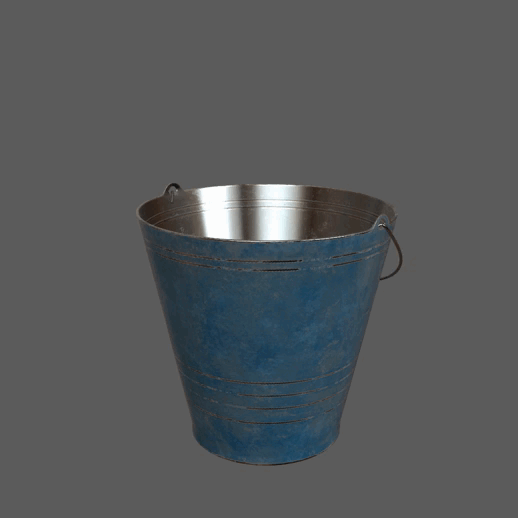
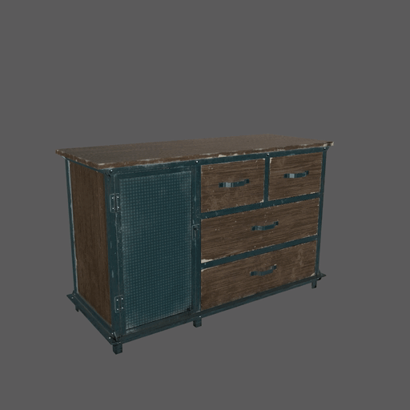
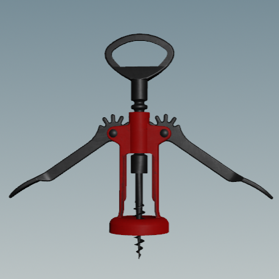
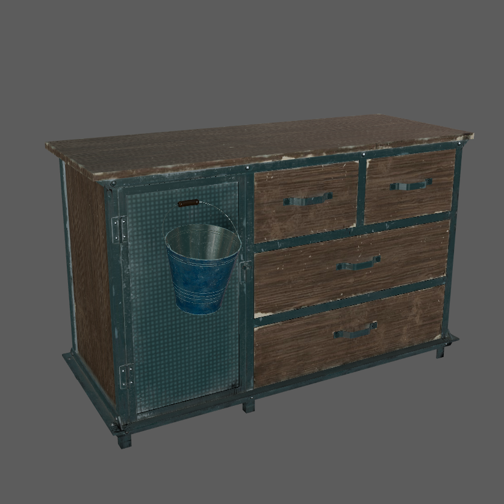

TODO & Questions:
- todo: Cleanup Example asset composition.
- todo: add comparison between proxy and render. VP + Outliner
- todo: add dressing workflow. Transform + posing
- todo: add asset-level pose VariantSet variant exploration.
- todo: add Credits to README
- 
- What is the proxyPrim relationship used for? VP selection workflows?

- What do we call Composition and structure when talking about usd assets.\
  Composition sounds like composition arcs and layer/file organization,
while structure is the final resulting prim hierarchy?
 
- Assemblies and subcomponent's composition/structure looks very similar.\
  Any notable differences? Assemblies are not self-contained. Instancing?
  pd: looking at assemblies it works that way, so it might not be that wierd after all.
- Should subcomponent prim replicate component structure geo, mtl scopes.\
  It looks counterintuitive to have meshes outside /geo?\
- Can we come up with a go-to/recommended structure for subcomponents?.\
Similar to Assemblies, support purposes and nested subcomponents.

- Future considerations with Assemblies that are made out of Components attached to subcomponents.\
ex: some tools attached to the WoodenTable.door subcomponent.\
Examples continuing in this direction will soon need a rig. Can be handled with rig-swapping.

- Is there any issue having meshes have kind subcomponent directly applied? or is better to only apply it to xforms? What about the use of purpose in that case?


# How to take advantage of subcomponents in production




## What are Subcomponents?
In USD terms, [subcomponents](https://openusd.org/release/glossary.html#usdglossary-subcomponent)
are a [kind](https://openusd.org/release/glossary.html#usdglossary-kind) that can be assigned to a prim.
[see more](https://github.com/usd-wg/assets/blob/main/docs/asset-structure-guidelines.md).

## Composition

**Simple Subcomponent** (Bucket example) Variations to consider:

```
/Bucket                 (xform) ← Component Kind
    /geo                (scope)
        /bucket         (mesh)
        /handle         (mesh) ← Subcomponent Kind★
    /mtl                (scope)
/\_\_class\_\_          (class)
    /Bucket             (class) ← Inherited by /<component>
```

```
/Bucket                 (xform) ← Component Kind
    /geo                (scope)
        /bucket         (mesh)
        /handle         (xform) ← Subcomponent Kind★
            /wire       (mesh)
            /handle     (mesh)
    /mtl                (scope)
/\_\_class\_\_          (class)
    /Bucket             (class) ← Inherited by /<component>
```

Subcomponents should be outside of geo, right?

```
/Bucket                 (xform) ← Component Kind
    /geo                (scope)
    /mtl                (scope)
    /handle             (xform) ← Subcomponent Kind★
        /geo            (scope)
/\_\_class\_\_          (class)
    /Bucket             (class) ← Inherited by /<component>
```

**Simple Subcomponent - With Purpose Scopes** (Bucket example)

```
/Bucket                 (xform) ← Component Kind
    /geo                (scope)
        /proxy          (scope) ← Purpose: proxy★
        /render         (scope) ← Purpose: render★
    /mtl                (scope)
    /handle             (scope) ← Subcomponent Kind★
        /geo            (scope)
            /proxy      (scope) ← Purpose: proxy★
            /render     (scope) ← Purpose: render★
        /mtl            (scope)
/\_\_class\_\_          (class)
    /Bucket             (class) ← Inherited by /<component>
```

**Shallow Subcomponent** (WoodenTable example)

```
/WoodenTable            (xform) ← Component Kind
    /geo                (scope)
        /render         (scope)
        /proxy          (scope)
        /door           (scope) ← Subcomponent Kind★
            /render     (scope)
            /proxy      (scope)
        /drawers        (xform) ← Group Kind★
            /drawer1    (scope) ← Subcomponent Kind★
                /render (scope)
                /proxy  (scope)
            /drawer2    (scope) ← Subcomponent Kind★
            /drawer3    (scope) ← Subcomponent Kind★
            /drawer4    (scope) ← Subcomponent Kind★
    /mtl                (scope)
/\_\_class\_\_          (class)
    /WoodenTable        (class) ← Inherited by /<component>
```

Subcomponents should be outside of geo, right?

```
/WoodenTable        (xform) ← Component Kind
    /geo            (scope)
    /mtl            (scope)
    /door           (scope) ← Subcomponent Kind★
        /geo        (scope)
        /mtl        (scope)
    /drawers        (xform) ← Group Kind★
        /drawer1    (scope) ← Subcomponent Kind★
            /geo    (scope)
            /mtl    (scope)
        /drawer2    (scope) ← Subcomponent Kind★
        /drawer3    (scope) ← Subcomponent Kind★
        /drawer4    (scope) ← Subcomponent Kind★
/\_\_class\_\_      (class)
    /WoodenTable    (class) ← Inherited by /<component>
```

**Nested Subcomponent** (Antenna example)

```
/Antenna                (xform) ← Component Kind
    /geo                (scope)
    /mtl                (scope)
    /base               (scope) ← Subcomponent Kind★
        /geo            (scope)
        /mtl            (scope)
        /upperArm       (scope) ← Subcomponent Kind★
            /geo        (scope)
            /mtl        (scope)
            /lowerArm   (scope) ← Subcomponent Kind★
                /geo    (scope)
                /mtl    (scope)
                /...
/\_\_class\_\_      (class)
    /Antenna        (class) ← Inherited by /<component>
```

## Uses for Subcomponents

- Proxy mesh generation
- Articulations
- Auto rigging
- Rig-swapping

### Proxy mesh generation

To generate the proxy purpose geometry, we can make it manually if needed or, more commonly,
using an automated process that merges the meshes into one prim and optimizes the topology. This is something very common, what we did was use the
kind:subcomponent to filter prims so that we don't merge them, that way we can still have articulation represented in the proxy purpose.

The geometry under the proxy scopes should have:
- as few prims as possible without loosing articulated pieces.
- as few polygons while maintain volume and silhouette.

- todo: add comparison between proxy and render. VP + Outliner

### Articulations

\

Articulations are movable elements within the asset.
It typically involves child primitives with strategically placed pivots and is identified by a kind:subcomponent designation.
These articulations serve as the adjustable elements that contribute to the asset's flexibility and adaptability.

Articulations are ***rigid*** when only xform transformations are required.

Articulations can be used to reduce asset repetition and to adapt to their surroundings, creating a more cohesive look in the scene.

For instance, consider an Oven asset; rotating the door (articulated piece) achieves the open/closed pose.

- todo: add dressing workflow. Transform + posing -- move bucket to position, rotate and adjust handle to adapt to terrain.

note: this workflow allows maximum flexibility at the cost of instancing. see more in the Optimization & instancing section.


#### Optimization & instancing
Articulated assets come with a limitation – they cannot be both posed and instanced simultaneously.\
This is due to the fact that when a parent prim is made instanceable, the child prims won't receive any edits.

To address this limitation, a workaround can be employed, particularly when a few distinct poses are enough.

One effective workaround involves creating a "pose" VariantSet within the Model's defaultPrim,
acting as a repository for a library of poses. Variants are added to this VariantSet,
offering a flexible solution for managing different poses that can be instanced.

ignore note: Is there a way to make the subcomponents instanceable so only a xform is authored. but the mesh is instanced in any range of movement ?

This are the variants defined in the pose VariantSet at the asset level.
- todo: add asset-level pose VariantSet variant exploration.

This is an example of how to use asset-level variants in dressing. 
todo: Add link to example_dressing_variants.usda

Additionally, extra poses can be added from a Dressing/Shot definition. see more in the example file.

Usecase where we need to dress the cube upsidedown, lets assume thats a rare enough case that it shouldnt be defined in the asset.\
But in this dressing scene we can use it to make use of instances.

Example file of a dressing where the upside_down variant is added just for that dressing.
todo: Add link to example_dressing_variants.usda


### Deformable articulations with usdSkel

Not done yet. ex: Tree


### Autorig & rig swapping

Not done yet. Coming later:

- Abstractly describe auto-rig procedure. Implementation is up to the client.
- Abstractly describe rig-swapping procedure.
- Describe workflow to show potential value.
  - If we have an articulated asset that will benefit from IK posing or other complex relationship between pieces.\
We can do a rig swap, use the rig controllers to set the pose. Then switch back, giving the subcomponent groups their new transforms.
  - A layout/Animator artist can select a Component Model and expose a rig right in the exact same pose that asset is at.\
ex: The Bucket in the floor with the handle posed, when rig swapped the rig will match the pose.
- Describe challenges: ex: Having the subcomponents in sync with the rig controls if using manual made rigs.\
This will be a potential challenge and depends on the implementation.

todo: Add examples showing workflows:
- Gif from Maya VP as a SetDressing artist
- Gif From Maya VP as an Animator rig-swapping a posed asset to start animating. --Bucket in floor.

### Coming next

- Deformable Articulations -- USDSkel
- Autorig from subcomponents
- Autorig from usdSkel
- Assets where mechanical pieces need to work together -- rig-swapping
- Asset level anim cycles -- fan rotation
- Animation Proxy/lod workflow.

### Limitations



Assets where mechanical pieces need to work together, cant have that behaviour described at the current state of openUsd.\
It will need a 3rd party rig like a maya rig and rig-swapping. Also assets with cables/ropes connecting articulated pieces.

## Credits

-- Model Credits --

https://sapien.ucsd.edu/browse

## License

This work is licensed under [CC BY 4.0](https://creativecommons.org/licenses/by/4.0/) by the Academy Software Foundation.
