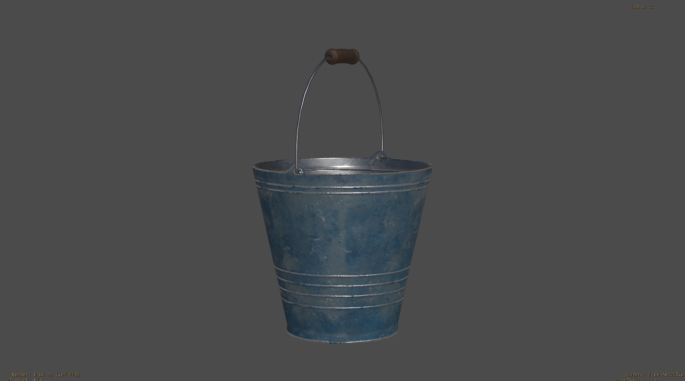

# Some Title

-- Asset description --
## TODO
- describe bullet points in workflows.
- Remove all the part of asset classification and articulation. just abstract that logic and use any asset with subcomponents. no need to describe asset classification logic.
- focus on usecases for subcomponents.
- main topics: kind, purpose, lod generation, dressing,variants

## Objective
In this page we are going to describe how subcomponents can be used in a vfx/animation production for different workflows.

set definition
- definition
- pivot
- lod generation
- autorig

set dressing
- use of subcomponent prim to pose the asset to reduce repetition and improve set adaptation.
- optimizing poses with variants while reducing repetition

animation
- swap for rig and back (rigid vs deformable articulation round tripping)

Show ways to laverage usd composition and subcomponents to describe efficient articulated assets.
 - what are subcomponents? (no need)
 - What are articulated assets?
 - Benefits and challenges
 - Composition examples
 - laverage examples
 - limitations

### What are subcomponents?

Subcomponent is a kind that can be applied to a prim. Different DCCs allow the user to have a pick mode to easily select this prims from the viewport.
So, for the purpose of this page, just remember that it helps with easy selection of prim hierarchies from the viewport.

### What are articulated assets?

Like in many other usd definitions, assets/models can be described as detailed as needed wanted. ex: you might have a building as a single component asset with one prim. Or have a very detailed assembly model that uses other assets like flowerpots, windows shutters...etc with that said, articulation is an extra level of detail/complexity and is not needed for every asset.

So what do I mean when I say articulated? Articulation can be __*rigid*__ , when only an xform transformation is required or __*deformable*__ when the points/vertex need to be transformed non-uniformly. At the end of the day rigid articulations can be described as a deformable ones but that inefficient.

Articulations can also be __*static*__ or __*animated*__. 

|            | Rigid | Deform |
|------------|-------|--------|
| Static     |   Bucket   |    Tree    |
| Animated   |   Fan   |    Tree   |

When using subcomponents and for this page, we are gonna only make use of static rigid articulations.

### Bennefits and challenges
Benefits

Challenges

Articulated assets can't be instanceable, at least not if we want to have an edit on a child prim. There is a way to optimize this by generating variant at the rootprim, making a "library" of articulation posibilities

### Composition examples
- simple rigid 
### laverage examples
- generate lods for articulable assets
- autorig articulable assets

### Limitations

Assets where mechanical pieces need to work together, cant have that behaviour described at the current state of openUsd.\
It will need a 3rd party rig like a maya rig.

## Credits

-- Model Credits --

https://sapien.ucsd.edu/browse

## License

This work is licensed under [CC BY 4.0](https://creativecommons.org/licenses/by/4.0/) by the Academy Software Foundation.
